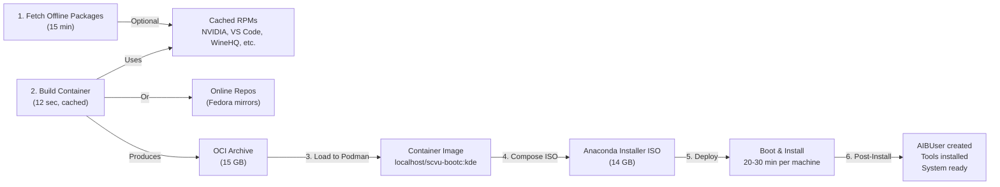

# SCVU Bootc Workstation: Presentation Guide

## 🎯 Presentation Overview

This guide helps you structure a compelling presentation about the SCVU Bootc Workstation project. It's organized by audience type and covers technical depth, business value, and practical deployment.

---

## 📊 Part 1: Executive Summary (5 mins)

### Opening Hook
> "How would you like to deploy identical, fully-configured workstations across your organization—completely offline—in under 30 minutes each?"

### The Problem We Solve
- **Traditional approach:** Fresh OS install + manual package installation + configuration = hours per machine
- **Air-gapped environments:** No network access to repos, making standard installs impossible
- **Consistency issues:** Manual configs lead to drift, support nightmares, security gaps
- **Waste:** Redundant work, repeated mistakes, inconsistent environments

### Our Solution
**SCVU Bootc Workstation** = Container-based OS image embedded in an ISO installer

**Result:**
- ✅ Deploy in 20–30 minutes
- ✅ Works completely offline
- ✅ Identical config across all machines
- ✅ Pre-configured with 150+ packages
- ✅ Interactive or automated installation
- ✅ No network required during deployment

### Key Numbers
| Metric | Value |
|--------|-------|
| Deployment Time | 20–30 min per machine |
| ISO Size | ~14 GB (all-inclusive) |
| Pre-installed Packages | 150+ |
| Supported Python Versions | 3.9–3.13 |
| Disk Space (Installed) | ~25 GB minimum |
| Network Required | None (fully offline) |

---

## 📊 Part 2: The Technology (10 mins)

### What is Bootc?

**Traditional Linux Installer:**
```
Live USB → Anaconda → dnf install → Custom scripts → Unique System
```
- Each install pulls from repos (network-dependent)
- Configurations can differ
- Takes time, prone to errors

**Bootc Approach:**
```
Pre-built Container Image → ISO Embedding → Single Boot → Identical System
```
- Entire system pre-built and tested
- Installed as immutable rootfs
- Reproducible across 1000+ machines

### Architecture Diagram

```
BUILD PHASE (Online, Once)
├─ Containerfile (image definition)
├─ Podman Build Container
├─ Include 150+ packages, ML libs, dev tools
├─ Create OCI Archive
└─ Embed in ISO Installer

DEPLOYMENT PHASE (Offline, Per-Machine)
├─ Boot ISO
├─ Interactive Disk Selection (optional)
├─ Anaconda Installer
├─ Extract Container to Disk
├─ First Boot
├─ Optional Post-Install Script
└─ Ready-to-Use System
```

### What's Included?

**Desktop & System**
- Fedora 43 KDE Plasma
- SDDM login manager
- NetworkManager, Avahi (mDNS), XRDP (remote desktop)

**Development**
- Python 3.9, 3.10, 3.11, 3.12, 3.13
- VS Code, Git, GCC/Make/CMake
- Docker, Podman, rootless containers

**AI/ML Stack**
- NumPy, SciPy, pandas, Matplotlib
- scikit-learn, Jupyter, OpenCV
- Triton inference client
- HDF5, LAPACK, OpenBLAS (optimized math libs)

**Graphics & NVIDIA**
- NVIDIA CUDA drivers
- Blender, GIMP, Inkscape
- OpenGL/Vulkan support

**Multimedia**
- FFmpeg, VLC, OBS Studio
- Audio editing tools
- WebM/AV1 support

**Additional Tools**
- OpenShift/Kubernetes (oc, kubectl)
- CodeReady Containers (local OpenShift)
- LibreOffice, QGIS, Draw.io
- WineHQ, Lutris (Windows emulation & compatibility)
- Samba, rsync (file sharing)

**Windows Integration & Filesystem Support**
- NTFS/ExFAT read-write support (external drives, USB)
- SMB/CIFS network shares (Windows file servers)
- Windows Service Discovery (wsdd)
- mDNS/Avahi (network browsing)
- Compatible with dual-boot scenarios (direct Windows partition access)

---

## 🔄 The Bootc Upgrade Model: A Smartphone OS Update Analogy

### Traditional vs. Bootc Upgrades

| Aspect | Traditional Linux | Bootc Upgrade |
|--------|------------------|---------------|
| **Update method** | Patch individual packages incrementally | Replace entire filesystem atomically |
| **While running** | Update & risk conflicts, partial failures | Download & test new image, zero interruption |
| **On reboot** | Might fail partway through, corrupted state | Instant switch to new OS or rollback |
| **Failed update** | Broken system, manual recovery needed | Auto-fallback to previous known-good version |
| **Consistency** | Drift over time, each machine different | All machines guaranteed identical after update |
| **Real-world** | Updating individual Android apps mid-system | Like iOS/Android major OS update: tested, atomic, rollback-capable |

### What Happens During `bootc upgrade`

1. **Background Preparation** (System running normally)
   - New OCI image downloaded
   - Container converted to ostree commit
   - Staged in bootloader (no current system affected)
   - Time: 5–10 min depending on image size

2. **Safety Check** (Zero interruption)
   - New deployment validated
   - Current system remains active
   - No package conflicts possible (immutable rootfs)

3. **Atomic Reboot** (All or nothing)
   - On reboot, kernel switches to new ostree deployment
   - Bootloader updated with new default boot entry
   - Previous deployment kept as fallback

4. **Automatic Rollback** (If needed)
   - New system fails to boot? → Auto-fall back to previous entry
   - New system hangs? → User can manually select previous entry from GRUB
   - Never leaves system broken

5. **Persistent Data Preserved**
   - `/home` directory untouched (writable overlay)
   - User configs, documents, all remain
   - Only immutable rootfs replaced

### Enterprise Deployment Implication

**Deploy new SCVU v2.0 to 100 machines:**
```
Create v2.0 image → Push to registry → Run on each machine:
  $ sudo bootc upgrade --container-image-reference registry/scvu-bootc:v2.0
  
→ All 100 machines fully updated in parallel
→ Synchronized, atomic, rollback-capable
→ Zero deployment inconsistency
```

---

## 📊 Part 3: Build Process (8 mins)

### High-Level Build Flow



### Step-by-Step Walkthrough

**Step 1: Fetch Offline Packages (Optional)**
```bash
./fetch_all_offline.sh
```
- Downloads NVIDIA drivers, VS Code, Docker Desktop, WineHQ, draw.io, OpenShift tools
- Time: 10–20 minutes (depends on internet, file sizes)
- Result: Cached in `image/offline-repo/`
- Benefit: Build can proceed without network

**Step 2: Build Container Image**
```bash
cd bootc_ostree/build-scripts
./build-iso-helper.sh interactive
```
- Reads `Containerfile` (804 lines)
- Builds on Fedora 43 bootc base
- Installs 150+ packages
- Time: 12 sec (cached after first build) to 5 min (first build)

**Step 3: Export OCI Archive**
- Saves container image to disk file
- Time: ~40 sec
- Size: ~15 GB

**Step 4: Compose ISO**
- Embeds OCI archive + Anaconda installer
- Creates bootable ISO
- Time: ~8 min
- Size: ~14 GB

**Step 5: Deploy ISO**
```bash
sudo dd if=bootc_ostree/output/bootiso/SCVU.iso of=/dev/sdX bs=4M status=progress
```
- Write to USB drive or SSD
- Time: 5–15 min (depends on USB speed)
- Result: Bootable installation media

### Build Time & Disk Requirements

| Phase | Time | Disk Used | Cached? |
|-------|------|-----------|---------|
| Fetch Offline | 10–20 min | 5–10 GB | Yes |
| Build Container | 12 sec–5 min | 28 GB (on disk) | Yes (subsequent builds use cache) |
| Export OCI | ~40 sec | 15 GB | No |
| Compose ISO | ~8 min | 14 GB | No |
| **Total** | **25–35 min** | **~60 GB** | Partial |

---

## 📊 Part 4: Installation Modes (7 mins)

### Mode 1: Interactive (Anaconda UI)

**Best for:** End-users, varied hardware, dual-boot scenarios

**Boot Experience:**
```
1. GRUB Menu
   ↓
2. Anaconda Installer Loads
   ↓
3. Welcome Screen [User clicks Next]
   ↓
4. Disk Selection [User chooses /dev/sda, /dev/sdb, etc.]
   ↓
5. Partitioning [User creates custom layout if desired]
   ↓
6. User & Root Setup [User creates account, sets password]
   ↓
7. Timezone & Locale [User selects region]
   ↓
8. Installation Begins [System deploys container image]
   ↓
9. First Boot → Ready
```

**Time:** 20–30 min (includes user interactions)

**Advantages:**
- Familiar GUI (looks like traditional Linux installer)
- Flexible partitioning
- Custom user creation
- Ideal for diverse hardware

**Screenshot Callouts:**
- "Partitioning UI allows standard or custom layouts"
- "User creation page for AIBUser setup"

---

### Mode 2: Non-Interactive (Bootc Automatic)

**Best for:** Identical hardware, CI/CD, rapid mass deployment

**Boot Experience:**
```
1. GRUB Menu [Auto-continues after 5 sec]
   ↓
2. Automatic Disk Detection [System finds target disk]
   ↓
3. Automatic Partitioning [Standard LVM layout]
   ↓
4. Container Deployment [Image writes to disk]
   ↓
5. First Boot → Ready
```

**Time:** 15–20 min (no user interaction)

**Advantages:**
- Fastest deployment
- Perfect for automation/scripting
- Identical results every time
- Minimal training needed

**Use Case Callout:**
- "Deploy 100 identical servers in data center overnight"

---

### Comparison Table

| Aspect | Interactive | Non-Interactive |
|--------|-------------|-----------------|
| **User Interaction** | High | None |
| **Flexibility** | Customizable partitions | Fixed layout |
| **Time per Machine** | 20–30 min | 15–20 min |
| **Ideal For** | Desktops, varied HW | Servers, identical HW |
| **Learning Curve** | None (familiar UI) | None (fully auto) |
| **Customization** | Per-machine | Build-time only |

---

## 📊 Part 5: Smart Features (8 mins)

### Feature 1: AIBUser Automatic Account Creation

**The Problem:**
- New systems need user accounts
- Manual creation is error-prone
- Scripts can fail silently

**Our Solution:**
- Automatic AIBUser creation post-install
- Default password: `AIBUser@A!BUser`
- Auto-added to Docker group
- README deployed to Desktop
- Idempotent (safe to run multiple times)

**Implementation:**
```bash
# Post-install (optional, but recommended)
sudo /usr/local/bin/scvu/scvu-post-install.sh
```

**What It Does:**
```
✓ Create AIBUser account
✓ Set password (configurable)
✓ Add to docker group (container development)
✓ Copy README to Desktop
✓ Create home directory with defaults
✓ Configure shell (bash)
✓ Set permissions correctly
```

**User Experience:**
- Boot system → Run post-install → Login as AIBUser → All tools ready

---

### Feature 2: Offline Python Wheels

**The Problem:**
- ML/data science work requires NumPy, pandas, etc.
- Installing from source is slow (compile time)
- Air-gapped environments can't download

**Our Solution:**
- Pre-download all wheels for Python 3.9–3.13
- Baked into the image
- Fast post-install: `pip install --no-index --find-links /opt/python-wheels/`

**What's Pre-Downloaded:**
- numpy, scipy, pandas, matplotlib
- scikit-learn, jupyter, ipython, seaborn
- opencv-python, tritonclient[all]
- All dependencies included

**Installation Speed:**
```
Traditional (Online, Compile):    5–10 minutes
Offline (Pre-built Wheels):       30–60 seconds
```

---

### Feature 3: Multi-Disk Safety

**The Problem:**
- Installing to wrong disk = catastrophic data loss
- Non-interactive mode can be risky on multi-disk systems
- Users need confidence in disk selection

**Our Solution:**

```bash
# System automatically detects available disks
# User is prompted to select target disk
# Confirmation prompt before installation
```
- Installer displays all available disks with sizes
- User selects target disk from list
- Confirmation prompt before installation


---

### Feature 4: Modular Post-Install

**The Problem:**
- Not all systems need all packages
- Some environments can't run GPU drivers
- Flexible deployment needed

**Our Solution:**
- Post-install script with selective flags

**Examples:**
```bash
# Full post-install
sudo /usr/local/bin/scvu/scvu-post-install.sh

# Skip GPU drivers (non-NVIDIA systems)
sudo /usr/local/bin/scvu/scvu-post-install.sh --skip-nvidia

# Python wheels only
sudo /usr/local/bin/scvu/scvu-post-install.sh --wheels-only

# Specific Python versions
sudo /usr/local/bin/scvu/scvu-post-install.sh --py py310 --py py311

# Skip user creation (CI/CD automation)
sudo /usr/local/bin/scvu/scvu-post-install.sh --skip-create-user
```

---

## 📊 Part 6: Use Cases & Real-World Scenarios (10 mins)

### Scenario 1: Enterprise Workstation Deployment

**Context:** Tech company deploying 50 developer workstations

**Traditional Approach:**
- IT team spends 40 hours installing/configuring (1 hour per machine + overhead)
- Inconsistent setups (some missing packages)
- Support tickets for "why doesn't mine work?"

**SCVU Bootc Approach:**
```
Day 1: Build ISO (30 min) + Test (30 min)
Day 2–3: Deploy 50 machines (2–3 hours actual IT time, parallel)
  - Boot USB → Interactive mode → User picks disk → Done
  - Each machine takes 25 min
  - IT can supervise 5–10 simultaneously

Result: Identical, fully-configured systems in 2 days
Ongoing: No per-machine configuration needed
```

**Savings:** 38 hours IT time + 50 hours avoided configuration

---

### Scenario 2: Air-Gapped ML Research Lab

**Context:** Secure research environment with no internet access

**Challenge:** Installing ML libraries offline is painful

**SCVU Bootc Solution:**
```
Before Air-Gap (Online Network):
├─ Run: ./fetch_all_offline.sh
├─ Build: ./build-iso-helper.sh interactive
└─ Transfer ISO to air-gapped network (USB drive)

In Air-Gapped Lab:
├─ Boot ISO (completely offline)
├─ Install system (no network needed)
├─ All ML libraries present (numpy, scipy, sklearn, torch preloaded)
└─ Start research immediately

Benefits:
✓ Zero network operations needed
✓ Pre-tested environment
✓ Repeatable setup for all researchers
✓ No sneaker-net dependency for packages
```

---

### Scenario 3: Raspberry Pi / Edge Computing

**Context:** Deploy edge inference nodes for production

**Use Case:**
```
Build Phase (Online):
├─ Customize Containerfile for edge hardware
├─ Include only essential packages (smaller ISO)
├─ Pre-cache ML models
└─ Build minimal ISO (~8 GB)

Deployment Phase:
├─ Write ISO to microSD or SSD
├─ Boot edge device
├─ Non-interactive: Auto-detects hardware
├─ Start inference service immediately
└─ Monitor via remote API
```

---

### Scenario 4: Disaster Recovery / Quick Replacement

**Context:** Developer's workstation fails, needs replacement in 2 hours

**Traditional:**
- Find spare machine
- Install OS (20 min)
- Install tools (60 min)
- Configure environment (30 min)
- Still missing custom configs, SSH keys, etc.

**SCVU Bootc:**
- Find spare machine
- Boot SCVU ISO (25 min)
- Restore home directory from backup (5 min)
- Developer back to work (30 min total)

---

## 📊 Part 7: Architecture Deep Dive (8 mins)

### Container Image Structure

```
Fedora 43 Bootc Base (read-only rootfs)
├─ KDE Desktop Environment
├─ System Libraries & Tools
├─ Development Stack
│  ├─ Python 3.9–3.13
│  ├─ Node.js, npm, yarn
│  ├─ GCC, Make, CMake, Autotools
│  └─ Git, GitHub CLI
├─ ML/Data Science Libraries
│  ├─ NumPy, SciPy, pandas, Matplotlib
│  ├─ scikit-learn, Jupyter, OpenCV
│  ├─ TensorFlow dependencies
│  └─ HDF5, LAPACK, OpenBLAS
├─ Container Runtime
│  ├─ Docker/Docker Desktop
│  ├─ Podman (rootless capable)
│  └─ containerd, runc
├─ Graphics (GPU Support)
│  ├─ NVIDIA CUDA drivers
│  ├─ OpenGL, Vulkan libraries
│  └─ NVIDIA Tools, GPU monitoring
├─ Multimedia
│  ├─ FFmpeg, VLC, OBS Studio
│  ├─ GIMP, Inkscape, Blender
│  └─ Audio processing tools
└─ Pre-install Scripts
   ├─ AIBUser creation function
   ├─ Python wheel installer
   └─ Post-install orchestrator

Total Layer Size: ~28 GB (on disk)
Compressed (OCI): ~15 GB
After Installation: ~25 GB
```

### Comparison: Traditional vs. Bootc

**Traditional Linux**
```
Install OS → Package Management → Manual Config
├─ Each machine pulls from repos
├─ Can have network issues
├─ Configs drift over time
└─ Reproducibility: Low (60–80%)
```

**Bootc (Container-Based)**
```
Pre-built Container → Deploy → Ready
├─ Everything pre-tested
├─ No package repo dependency
├─ Reproducibility: Very High (99.9%)
└─ Significantly faster
```

---

## 📊 Part 8: Customization & Future Roadmap (6 mins)

### Current Customization Points

**Easy (Edit & Rebuild):**
- Timezone (line 14 of Containerfile)
- NTP servers (lines 17–21)
- Additional Python packages (line 120)
- Extra system packages (add RUN dnf install)
- Custom scripts (embedded in post-install)

**Medium (Advanced):**
- Different base OS (change FROM, line 1)
- Custom desktop environment (replace KDE)
- Minimal variant (strip multimedia, gaming)
- Target-specific optimization

**Example: Minimal Variant**
```dockerfile
# Remove:
# - NVIDIA drivers (use generic graphics)
# - Windows emulation (Wine, Lutris)
# - Multimedia apps (Blender, OBS)
# Result: ~10 GB ISO instead of 14 GB
```

### Future Enhancement Ideas

**Short Term (Q1 2026):**
- [ ] Configuration UI for customization wizard
- [ ] Pre-built minimal/standard/full variants
- [ ] Automated testing framework
- [ ] Ansible playbook for mass deployment

**Medium Term (Q2 2026):**
- [ ] Support for other architectures (ARM, RISC-V)
- [ ] Encrypted root filesystem option
- [ ] SELinux/AppArmor profile variants
- [ ] Integration with CI/CD platforms (GitHub Actions, GitLab CI)

**Long Term (Q3–Q4 2026):**
- [ ] Multi-region content delivery
- [ ] Signed image verification
- [ ] OTA (over-the-air) update mechanism
- [ ] Enterprise support & SLAs

---

## 📊 Part 9: Q&A Talking Points (5 mins)

### Q: "Why not just use Docker/Podman containers for development?"
**A:** 
- Containers are great for apps, but not for full desktop environments
- Bootc gives you entire OS + desktop + all dev tools in one reproducible image
- You get container benefits (reproducibility, testing) + full desktop experience
- Perfect for when you need graphics (ML visualization, software development)

---

### Q: "Can we customize packages for different teams?"
**A:**
- Yes! Edit Containerfile, rebuild, get new ISO
- Or use modular flags in post-install script
- Can create variants: minimal/standard/enterprise
- Rebuild takes 25–35 min, distributes instantly after

---

### Q: "What about updates and patches?"
**A:**
- Current model: Rebuild ISO with updated packages
- Future roadmap: OTA updates (container image push)
- Security patches: Rebuild + redeploy ISO to critical systems
- Version tracking: Git tags for each ISO build

---

### Q: "Is this only for Fedora?"
**A:**
- Current: Fedora 43 bootc base
- Adaptable: Could use RHEL bootc, CentOS Stream, Ubuntu bootc
- Process is identical, just change base image
- Team can explore other bases based on needs

---

### Q: "How do we handle user data / home directories?"
**A:**
- Home directory is writable (separate from immutable rootfs)
- Can backup/restore home folders between machines
- Supports NFS mounts for centralized home storage
- Git for configs, rsync for backups

---

### Q: "What's the overhead of Bootc vs. traditional Linux?"
**A:**
- Memory: Negligible (<1 GB extra for container runtime)
- Disk: Identical (immutable rootfs is just read-only, no overhead)
- Performance: Identical (rootfs performance equals traditional)
- Benefit: Reproducibility + consistency + faster deployment

---

### Q: "Can we run this on AWS/Azure/GCP?"
**A:**
- Not directly (Bootc designed for bare metal + VMs)
- Could containerize entire image for cloud (Kata Containers)
- More practical: Use for on-prem infrastructure, traditional cloud tools for cloud
- Future: Container Registry (Quay, Docker Hub) publishing

---

### Q: "What if we need to boot from network (PXE)?"
**A:**
- Not currently supported (ISO is disk-based)
- Could extend: Create PXE-bootable variant with dracut
- Future enhancement: Network boot support

---

## 📊 Part 10: Live Demo / Walkthrough (10 mins)

### Demo Script (If Showing Slides Only)

**Slide Deck + Narration Outline:**

1. **Title Slide** (30 sec)
   - "SCVU Bootc Workstation: Offline, Reproducible System Deployment"
   - Show ISO file (14 GB)

2. **Problem/Solution** (1 min)
   - "Traditional install: 2 hours per machine"
   - "Bootc install: 25 minutes per machine"
   - Show time savings chart

3. **Architecture** (2 min)
   - Walk through build diagram
   - Show Containerfile preview
   - Explain what's included

4. **Build Process** (2 min)
   - Show terminal output: `./build-iso-helper.sh interactive`
   - Highlight "Build completed in 12s" (cached build)
   - Show ISO output file

5. **Installation Walkthrough** (3 min)
   - Show Anaconda UI screenshots (if available)
   - Highlight disk selection
   - Show post-install script output
   - Final login screen

6. **Live Q&A** (2 min)

### Demo Script (If Running Live)

**Setup Needed:**
- Bootc source code visible in editor
- Terminal ready in bootc_ostree/build-scripts/
- ISO file pre-built (show file properties)
- (Optional) VM with previous ISO installed

**Demo Steps:**
```bash
# 1. Show the Containerfile (key sections)
head -50 ../image/Containerfile
# Callout: "All tools defined in one place, reproducible"

# 2. Show offline packages
ls -lh ../image/offline-repo/
# Callout: "Pre-downloaded packages for air-gap deployment"

# 3. Trigger a build (or show cached build)
./build-iso-helper.sh interactive --iso-name DEMO.iso
# Callout: "Watch it build in real-time..."
# (Or show from log file if pre-built)

# 4. Show the ISO
ls -lh ../output/bootiso/SCVU.iso
# Callout: "14 GB, ready to write to USB"

# 5. Show post-install script
cat ../image/scvu-post-install.sh | head -100
# Callout: "Modular, selective installation"
```

---

## 📊 Part 11: Business Value / ROI (5 mins)

### Cost Savings Calculation

**Scenario: Deploy 100 Workstations**

**Traditional Approach:**
- IT time per machine: 2 hours (install + config)
- Total IT time: 200 hours
- IT hourly cost: $50/hour
- **Total cost: $10,000**

**SCVU Bootc Approach:**
- Build + test: 2 hours (one-time)
- IT time per machine: 0.5 hours (supervise install)
- Total IT time: 50 hours + 2 hours setup
- IT hourly cost: $50/hour
- **Total cost: $2,600**

**Savings: $7,400 (74% reduction)**

### Intangible Benefits
- **Consistency:** No more "works on my machine" issues
- **Support:** Reduced help desk tickets (everyone has same setup)
- **Security:** Unified security posture, simpler patching
- **Compliance:** Reproducible, auditable deployments
- **Speed:** Teams deploy faster, focus on projects
- **Knowledge:** Documented in code (Containerfile)

---

## 📊 Part 12: Closing / Next Steps (3 mins)

### Key Takeaways
1. **Fast Deployment:** 25 minutes vs. 2 hours per machine
2. **Offline-Capable:** Build once, deploy anywhere (even disconnected)
3. **Reproducible:** Same OS, same packages, same config—every time
4. **Flexible:** Interactive or automated modes
5. **Customizable:** Edit Containerfile, rebuild

### Call to Action
- "For enterprise deployment: Next step is pilot program (10 machines)"
- "For open source: Contributions welcome on GitHub"
- "For research: Custom variants available"

### Resources to Share
- **GitHub Repository:** [Link to SCVU_Bootc_Test]
- **Documentation:** INDEX.md (comprehensive guide)
- **Build Status:** BUILD_STATUS.md (current state)
- **Examples:** EXAMPLES.md (real-world scenarios)

### Contact / Questions
- "Open for Q&A on technical questions"
- "Contact IT leadership for enterprise licensing/support"
- "Check documentation for setup guides"

---

## 🎬 Slide Deck Structure (Suggested)

1. **Title** (1 slide) — 30 sec
2. **The Problem** (1 slide) — 1 min
3. **Our Solution** (1 slide) — 1 min
4. **Architecture Overview** (2 slides) — 2 min
5. **Build Process** (2 slides) — 2 min
6. **Installation: Interactive vs. Non-Interactive** (3 slides) — 3 min
7. **Smart Features** (4 slides) — 4 min
8. **Use Cases** (3 slides) — 3 min
9. **Demo / Live Show** (varies) — 5–10 min
10. **Business Value / ROI** (1 slide) — 2 min
11. **Q&A** (1 slide) — 5–10 min
12. **Closing** (1 slide) — 1 min

**Total Presentation Time: 40–50 minutes (flexible based on Q&A)**

---

## 📊 Audience-Specific Variants

### For Technical Audience (Developers/DevOps)
- **Focus:** Architecture, customization, automation
- **Add:** Containerfile deep-dive, CI/CD integration, scripting
- **Time:** 60 minutes
- **Key Slides:** Build process, modular design, future roadmap

### For Business Audience (Managers/Executives)
- **Focus:** ROI, time savings, consistency
- **Add:** Cost calculator, case studies, team productivity gains
- **Time:** 30 minutes
- **Key Slides:** Problem/solution, ROI analysis, closing

### For End Users (Support Teams)
- **Focus:** Installation, troubleshooting, post-install
- **Add:** Interactive walkthrough, common issues, support procedures
- **Time:** 45 minutes
- **Key Slides:** Installation modes, features, Q&A troubleshooting

### For Security / Compliance Audience
- **Focus:** Reproducibility, auditability, secure deployment
- **Add:** Signed builds, reproducible verification, update strategy
- **Time:** 45 minutes
- **Key Slides:** Architecture, customization, security/compliance

---

## 💡 Presentation Tips

### Visual Enhancements
- **Show live terminal output** (builds are visual)
- **Use screenshots** from actual Anaconda UI
- **Include diagrams** (data flow, architecture)
- **Demo videos** (optional, show deployment time)

### Narrative Flow
- **Start with the problem** (pain point they feel)
- **Show your solution** (concrete, specific)
- **Prove it works** (demo or case study)
- **Show the impact** (time saved, money saved)
- **Call to action** (what's next?)

### Pacing
- **Slow down on key points** (ROI, unique features)
- **Speed up on technical details** (unless technical audience)
- **Pause for questions** (check for understanding)
- **Build suspense** (save best feature for middle)

### Engagement
- **Ask rhetorical questions** ("Ever spent 2 hours installing a machine?")
- **Tell stories** (use case scenarios)
- **Show numbers** (saves 74% IT time)
- **Live demo** (most engaging if it works)
- **Invite interaction** (Q&A, polls, discussion)

---

## 🎯 Sample Presentation Timeline

### 40-Minute Presentation

| Time | Content | Duration |
|------|---------|----------|
| 0:00 | Opening + Problem | 4 min |
| 4:00 | Solution Overview | 3 min |
| 7:00 | Architecture + Technology | 5 min |
| 12:00 | Build & Deployment Process | 5 min |
| 17:00 | Smart Features Deep-Dive | 5 min |
| 22:00 | Use Cases + Real-World Scenarios | 5 min |
| 27:00 | **Live Demo** | 8 min |
| 35:00 | Business Value / ROI | 3 min |
| 38:00 | Q&A + Closing | 2 min |

---

## 📋 Checklist for Presentation Day

- [ ] Test all demo machines (if live demo)
- [ ] Have ISO file ready on USB (backup)
- [ ] Screenshot backup (if live demo fails)
- [ ] Handout with key docs (INDEX.md, BUILD_STATUS.md)
- [ ] Contact info card or slide
- [ ] Backup: PDF of slides (USB drive)
- [ ] Test projector/screen (resolution, clarity)
- [ ] Microphone/audio check
- [ ] Slide notes visible (presenter view)
- [ ] Timer/clock visible
- [ ] Water available
- [ ] WiFi working (if needed for demos)

---

*This presentation guide is comprehensive but flexible. Adapt time, depth, and focus based on your specific audience and context. The key is to balance technical accuracy with business impact—show why it matters, not just how it works.*
